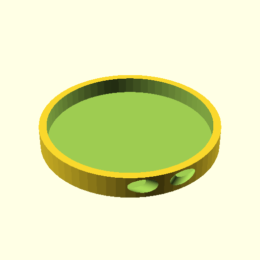
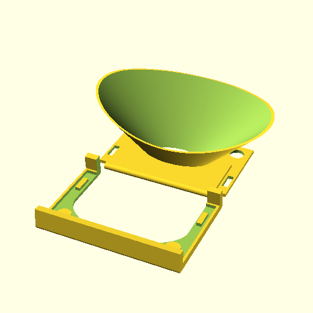

Some random things with no claim of usefulness :) Mostly for me to dump
some designs I want to share somewhere or not forget.

   - cello-endpin-holder: holds the endpin of a cello ([here an early version] (https://plus.google.com/u/0/+HennerZeller/posts/4s14tKttz5i))
   - dimension-bracket: simpler ruler for printer adjustment
   - scope phone adapter: an [adapter for my MotoX phone to my microscope](https://plus.google.com/u/0/+HennerZeller/posts/9eWFhvYqgtb)
   - snap joint test: little test to see how things can be snap joint (not
     terribly successful yet).
   - spool-holder: necessity - an axis adaptor for spools.
   - stacked-spool-holder: stack of spool holders, mount on top of printer.
   - webcam-hood: a hood for my Logitec C920 webcam.

All designs are (c) h.zeller@acm.org and licensed Creative Commons BY-SA.

Update list with:
```
(cd img ; for f in *.png ; do NAME=$(basename -s.png $f); echo "## $NAME"; echo '[!'"[$NAME](img/$f)]($NAME.scad)"; done)
```

# Generated images
## cello-endpin-holder
[](cello-endpin-holder.scad)
## dimension-bracket
[](dimension-bracket.scad)
## dosing-funnel-porta
[](dosing-funnel-porta.scad)
## light-bracket
[](light-bracket.scad)
## peristaltic-pump
[](peristaltic-pump.scad)
## rift-glass-holder
[](rift-glass-holder.scad)
## scope-phone-adapter
[](scope-phone-adapter.scad)
## snap-joint-test
[](snap-joint-test.scad)
## soap-holder
[](soap-holder.scad)
## solenoid-valve
[](solenoid-valve.scad)
## spool-holder
[](spool-holder.scad)
## stacked-spool-holder
[](stacked-spool-holder.scad)
## staircase
[](staircase.scad)
## webcam-hood
[](webcam-hood.scad)
